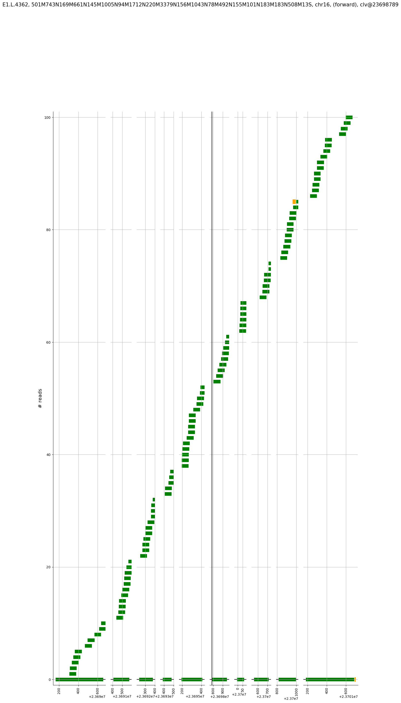

# VR2C

Visualize read-to-contig alignment.

**NOTE**: This package needs Python-3.6, and is still very rough around the
corners, but I just put it earlier in case anyone would like to contribute.

### Motivation

Visualizing read-to-contig alignment could be difficult because the number of
contigs could be huge compared to a typical genome, which has only a few dozens
of contigs/chromosomes. It may be difficult to index the contig FASTA file and
load it into a genome browser like
[IGV](http://software.broadinstitute.org/software/igv/).


### Usage

```
vr2c --contigs-to-genome test_data/c2g.sorted.bam --reads-to-contigs test_data/r2c_sorted.bam --contig-id [contig-id] --seqname [chromosome] --positions [positions]
```

Or equivalently

```
vr2c -c test_data/c2g.sorted.bam -r test_data/r2c_sorted.bam -t [contig-id] -s [chromosome] -p [positions]
```

By default it will save the output in `[chromosome]_[contig_id]_[positions].png`, or you
could change the output file name by specifying `--output/-o`.

```
vr2c --help
usage: vr2c [-h] -c CONTIGS_TO_GENOME -r READS_TO_CONTIGS -t CONTIG_ID -s
            SEQNAME -p POSITIONS [POSITIONS ...] [--figure-width FIGURE_WIDTH]
            [--seqname-beg-end SEQNAME_BEG_END SEQNAME_BEG_END] [-o OUTPUT]

plot r2c and c2g in one coordinate

optional arguments:
  -h, --help            show this help message and exit
  -c CONTIGS_TO_GENOME, --contigs-to-genome CONTIGS_TO_GENOME
                        input contig-to-genome alignment BAM file
  -r READS_TO_CONTIGS, --reads-to-contigs READS_TO_CONTIGS
                        input read-to-contig alignment BAM file
  -t CONTIG_ID, --contig-id CONTIG_ID
                        contig id, e.g. A1.J70460
  -s SEQNAME, --seqname SEQNAME
                        e.g. chr12. This is required because one contig could
                        be aligned to two chromosomes, e.g. hardclipping
  -p POSITIONS [POSITIONS ...], --positions POSITIONS [POSITIONS ...]
                        plot vertical lines for intended positions. e.g.
                        cleavage site
  --figure-width FIGURE_WIDTH
                        figure width, default to 16 based on experience
  --seqname-beg-end SEQNAME_BEG_END SEQNAME_BEG_END
                        if specified, the beginning and ending of the plot on
                        the chromosome are enforced, e.g. [25357088, 25357993]
  -o OUTPUT, --output OUTPUT
                        default to be <contig_id>.png
```

### An example use case

Output:
```
$ vr2c -c test_data/c2g.sorted.bam -r test_data/r2c_sorted.bam -t E1.L.4362 -s chr16 -p 23698789
2018-08-23 14:09:09,598|INFO|c2g_bam_file: test_data/c2g.sorted.bam
2018-08-23 14:09:09,598|INFO|r2g_bam_file: test_data/r2c_sorted.bam
329275it [00:00, 470121.10it/s]
2018-08-23 14:09:10,361|INFO|contig.query_name: E1.L.4362
2018-08-23 14:09:10,361|INFO|contig.is_reverse: False
2018-08-23 14:09:10,362|INFO|contig.cigarstring: 501M743N169M661N145M1005N94M1712N220M3379N156M1043N78M492N155M101N183M183N508M13S
2018-08-23 14:09:10,362|INFO|contig.reference_start: 23690160
2018-08-23 14:09:10,362|INFO|contig.reference_end: 23701688
2018-08-23 14:09:10,811|INFO|found 17779 reads; randomly pick 100
```

Generated plot:



*Legend*:

1. shown in the bottom is the contig
1. green are regular reads
1. yellow is softclip
1. red is hardclip (not available in this example)
1. introns are skipped and the distance between neighbouring exons are not to scale

### A few TODOs

1. currently, it only plot the first 100 reads per contig by default, need to make it adjustable
1. calculate figure size more properly, currently there could be excessive top margin as seen from above.
1. choose matplotlib backend accordingly
1. write tests


### Development

```
virtualenv venv
. venv/bin/activate

python setup.py develop
```
